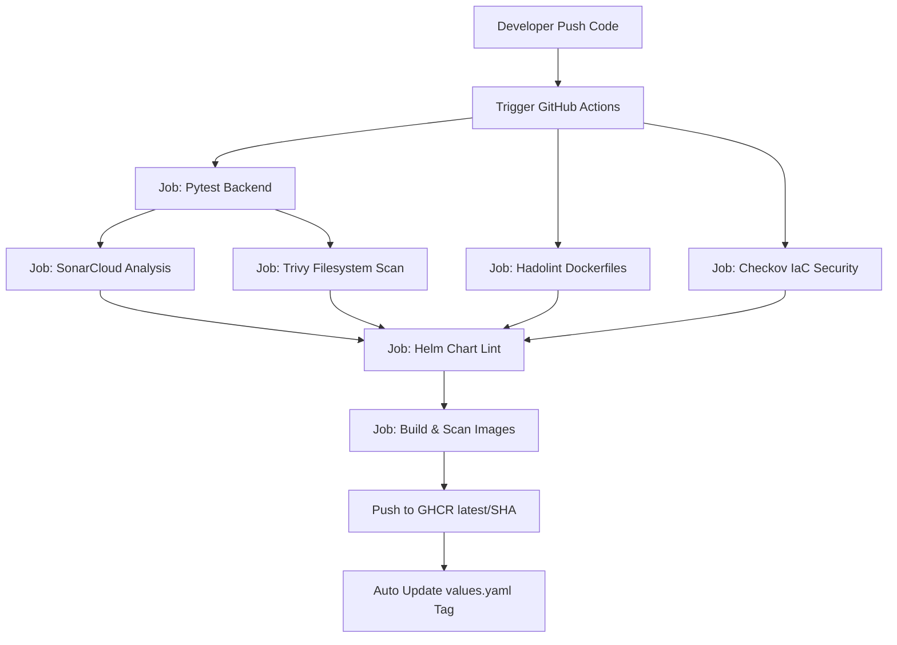

# Báo Cáo Đồ Án DevOps Cuối Kỳ - Hệ Thống MiniBlog (InkNotes)

> **Môn học:** SE359 - DevOps  
> **Sinh viên thực hiện:** [Tên Sinh Viên]  
> **Đề tài:** Xây dựng pipeline DevSecOps và triển khai GitOps cho ứng dụng FastAPI + PostgreSQL + Nginx  

---

## 1. Tổng Quan Dự Án & Kiến Trúc Hệ Thống

Dự án **InkNotes** là một ứng dụng MiniBlog cơ bản cho phép người dùng thực hiện các thao tác CRUD (Tạo, Đọc, Cập nhật, Xóa) bài viết. Hệ thống được thiết kế theo kiến trúc 3 lớp (3-tier architecture):
1. **Frontend (Nginx + Vanilla JS):** Đóng vai trò là Web Server phục vụ giao diện tĩnh và đồng thời làm Reverse Proxy chuyển tiếp các request API `/api/*` tới backend. Chạy non-root trên cổng `80` container (map ra host `8080` qua Docker Compose hoặc `8081` qua Kind NodePort).
2. **Backend (FastAPI):** Xử lý logic nghiệp vụ, cung cấp các RESTful API tại port `8000` container (map ra host `8002` qua Docker Compose, hoặc ClusterIP nội bộ trên K8s) và tích hợp sẵn Prometheus metrics exporter qua endpoint `/metrics`.
3. **Database (PostgreSQL):** Lưu trữ dữ liệu bài viết, chạy port `5432` nội bộ (không expose ra host).

### Sơ đồ Kiến trúc Triển khai trên Kubernetes (Kind/EKS)

```mermaid
graph TD
    Client[Client Browser] -->|Port 80/8081| Ingress[Ingress Controller / NodePort]

### Bảng Ánh Xạ Cổng (Port Mapping)

| Thành phần | Docker Compose | Kubernetes (Kind Dev) | Kubernetes (EKS Prod) | Ghi chú |
|-----------|---------------|----------------------|----------------------|---------|
| **Frontend (Nginx)** | `localhost:8080` → container `:80` | `localhost:8081` → NodePort `:30080` → container `:80` | LoadBalancer URL → container `:80` | Giao diện web blog |
| **Backend (FastAPI)** | `localhost:8002` → container `:8000` | ClusterIP nội bộ (dùng `kubectl port-forward svc/miniblog-backend 8003:8000`) | ClusterIP nội bộ | API + Swagger docs tại `/docs` |
| **Backend API Docs** | `localhost:8002/docs` | `localhost:8003/docs` (sau port-forward) | ClusterIP nội bộ | Swagger UI |
| **PostgreSQL** | Nội bộ (không expose host) | ClusterIP nội bộ | ClusterIP nội bộ | Chỉ backend mới gọi được |
| **Prometheus** | `localhost:9090` | `localhost:9090` (Docker Compose riêng) | ClusterIP nội bộ | Scrape backend `/metrics` |
| **Grafana** | `localhost:3000` (admin/admin) | `localhost:3000` (Docker Compose riêng) | ClusterIP nội bộ | Dashboard metrics |
| **ArgoCD UI** | — | `localhost:8083` (port-forward: `kubectl port-forward svc/argocd-server -n argocd 8083:443`) | ClusterIP nội bộ | GitOps dashboard |

> **Lưu ý:** Port của Docker Compose và Kind có thể khác nhau để tránh xung đột khi chạy đồng thời.
    Ingress -->|Forward| FE_Svc[Frontend Service: Port 80]
    FE_Svc -->|Load Balance| FE_Pods[Frontend Pods: Nginx Port 8080]
    FE_Pods -->|Proxy /api/*| BE_Svc[Backend Service: Port 8000]
    BE_Svc -->|Load Balance| BE_Pods[Backend Pods: FastAPI Port 8000]
    BE_Pods -->|Connect DB| DB_Svc[PostgreSQL Service: Port 5432]
    DB_Svc -->|Forward| DB_Pod[PostgreSQL Pod: Port 5432]
    DB_Pod -->|Persist Data| PV[Persistent Volume / emptyDir]
    
    Prometheus[Prometheus Server] -.->|Scrape /metrics| BE_Pods
    Grafana[Grafana Dashboard] -->|Query| Prometheus
```

---

## 2. Quy Trình DevSecOps CI/CD (GitHub Actions)

Quy trình CI/CD được tự động hóa hoàn toàn bằng GitHub Actions qua workflow `ci-cd.yml`, tích hợp chặt chẽ các bài kiểm tra bảo mật (DevSecOps) trước khi đóng gói và xuất bản.



### Các Công Cụ & Quy Trình Áp Dụng:

| Công cụ | Nhiệm vụ | Quy trình áp dụng |
|---------|----------|-------------------|
| **Pytest** | Kiểm thử đơn vị (Unit Test) | Chạy thử toàn bộ unit test của backend sử dụng SQLite in-memory để đảm bảo code logic chính xác. |
| **Hadolint** | Static analysis Dockerfile | Phân tích cú pháp Dockerfile của backend và frontend, đối chiếu với các best-practice để tối ưu kích thước image và nâng cao bảo mật. |
| **Checkov** | Quét bảo mật IaC (Kubernetes, Docker) | Quét các file manifest Kubernetes và cấu hình Dockerfile để phát hiện các lỗ hổng cấu hình sai (misconfigurations) như chạy quyền root, thiếu cấu hình limits tài nguyên. |
| **Trivy** | Quét lỗ hổng bảo mật (Filesystem & Image) | Quét toàn bộ thư mục mã nguồn và quét các Docker Image sau khi build để phát hiện các thư viện lỗi thời có lỗ hổng bảo mật (CVEs). |
| **Helm CLI** | Quản lý đóng gói ứng dụng K8s | Lint kiểm tra cú pháp và thử nghiệm sinh template (dry-run) cho cả môi trường DEV và PROD. |
| **yq CLI** | Thao tác sửa file YAML tự động | Dùng trong CI để tự động cập nhật image tag thành mã hash `GITHUB_SHA` mới nhất và push ngược lại repo để ArgoCD đồng bộ. |

### Cú Pháp Lệnh Áp Dụng Trong CI:

* **Chạy Unit Test:**
  ```bash
  pytest -v --junitxml=pytest-report.xml
  ```
* **Hadolint Linting Dockerfile:**
  ```bash
  hadolint blog-app/backend/Dockerfile --config blog-app/.hadolint.yaml
  ```
* **Checkov Scan Manifests:**
  ```bash
  checkov --directory blog-app/k8s --framework kubernetes --output cli
  ```
* **Trivy Filesystem Scan:**
  ```bash
  trivy fs blog-app --severity HIGH,CRITICAL --ignore-unfixed
  ```
* **Trivy Image Scan:**
  ```bash
  trivy image ghcr.io/owner/repo-backend:ci --severity HIGH,CRITICAL --ignore-unfixed
  ```
* **Tự động hóa cập nhật tag Helm trong CI:**
  ```bash
  yq -i ".backend.image.tag = \"${{ github.sha }}\"" blog-app/helm/miniblog/values.yaml
  yq -i ".frontend.image.tag = \"${{ github.sha }}\"" blog-app/helm/miniblog/values.yaml
  ```

---

## 3. Triển Khai Kubernetes & Helm (Lớp Deployment)

Ứng dụng được đóng gói hoàn toàn dưới dạng một **Helm Chart** tự chế để tăng khả năng tùy biến cấu hình theo môi trường (DEV/PROD).

### Giải Quyết Các Sự Cố Thực Tế:
1. **Lỗi Quyền Ghi PostgreSQL trên Windows/Kind:** Thư mục `/var/lib/postgresql/data` bị lỗi ghi khi mount volume do cơ chế phân quyền WSL2 của Docker Desktop Windows không khớp với ID User `999`. Khắc phục bằng cách cấu hình tắt `securityContext` cấp Pod/Container ở môi trường dev (`values-dev.yaml`) để container chạy dưới quyền root ảo rồi tự hạ quyền, đồng thời tắt volume persistent (dùng `emptyDir`).
2. **Lỗi Frontend Nginx Port 80 Non-Root:** Nginx mặc định chạy quyền root để lắng nghe cổng `80` (cổng đặc quyền). Để bảo mật tối đa và chạy non-root (`runAsUser: 101`), chúng ta chuyển cổng lắng nghe của container Nginx thành **`8080`**. Service bên ngoài vẫn mở cổng `80` và forward tới `targetPort: 8080`.

### Cú Pháp Lệnh Vận Hành Helm & Kubernetes:

* **Tạo Namespace:**
  ```bash
  kubectl create namespace blog-app
  ```
* **Cài đặt Helm Release (Môi trường DEV):**
  ```bash
  # MSYS_NO_PATHCONV=1 dùng để tránh lỗi biến đổi đường dẫn của Git Bash trên Windows
  MSYS_NO_PATHCONV=1 helm install miniblog ./helm/miniblog/ -f ./helm/miniblog/values-dev.yaml -n blog-app
  ```
* **Cập nhật Helm Release:**
  ```bash
  MSYS_NO_PATHCONV=1 helm upgrade miniblog ./helm/miniblog/ -f ./helm/miniblog/values-dev.yaml -n blog-app
  ```
* **Gỡ cài đặt Helm Release:**
  ```bash
  helm uninstall miniblog -n blog-app
  ```
* **Xem Trạng thái các Pods và Services:**
  ```bash
  kubectl get pods -n blog-app
  kubectl get svc -n blog-app
  ```
* **Kiểm tra Logs Pod (Ví dụ để debug):**
  ```bash
  kubectl logs -n blog-app -l app.kubernetes.io/component=backend --tail=100
  ```
* **Khởi động lại mượt mà Nginx Frontend (Xóa cache DNS):**
  ```bash
  kubectl rollout restart deployment miniblog-frontend -n blog-app
  ```

---

## 4. Hệ Thống Giám Sát Metrics (Prometheus + Grafana)

FastAPI backend được tích hợp middleware tự động đo lường thời gian xử lý và đếm request cho toàn bộ API endpoints.

### Cú Pháp Cấu Hình Prometheus Scrape (`prometheus.yml`):
```yaml
scrape_configs:
  - job_name: 'miniblog-backend'
    metrics_path: '/metrics'
    static_configs:
      - targets: ['backend:8000'] # backend là hostname của container trong Docker default network
```

### Cú Pháp Lệnh Chạy Local:
* **Khởi chạy Prometheus + Grafana:**
  ```bash
  docker compose -f monitoring/docker-compose.monitoring.yml up -d
  # Prometheus: http://localhost:9090
  # Grafana:    http://localhost:3000 (user: admin, password: admin)
  ```
* **Tải dữ liệu test lên hệ thống (Cú pháp curl tạo bài viết):**
  ```bash
  curl -i -X POST -H "Content-Type: application/json" \
    -d '{"title": "DevOps Project", "content": "Implementing DevOps pipeline successfully", "tag": "DevOps"}' \
    http://localhost:8081/api/posts
  ```
* **Đọc danh sách bài viết:**
  ```bash
  curl -i http://localhost:8081/api/posts
  ```

---

## 5. Triển Khai GitOps (ArgoCD)

ArgoCD đóng vai trò thực thi nguyên lý GitOps: Mọi thay đổi về cấu hình lưu trên Git Repo sẽ được tự động đồng bộ xuống Kubernetes Cluster.

### Cấu Hình Ứng Dụng GitOps (`application.yaml`):
```yaml
apiVersion: argoproj.io/v1alpha1
kind: Application
metadata:
  name: miniblog
  namespace: argocd
spec:
  project: default
  source:
    repoURL: https://github.com/kelvin2250/SE359_DevOps
    targetRevision: main
    path: blog-app/helm/miniblog
    helm:
      valueFiles:
        - values-prod.yaml
  destination:
    server: https://kubernetes.default.svc
    namespace: blog-app
  syncPolicy:
    automated:
      prune: true
      selfHeal: true
    createNamespace: true
```

### Cú Pháp Lệnh Vận Hành GitOps:
* **Cài đặt ArgoCD lên cluster:**
  ```bash
  kubectl create namespace argocd
  kubectl apply -n argocd -f https://raw.githubusercontent.com/argoproj/argo-cd/stable/manifests/install.yaml
  ```
* **Expose giao diện ArgoCD Web UI:**
  ```bash
  kubectl port-forward svc/argocd-server -n argocd 8083:443
  # Truy cập: https://localhost:8083
  ```
* **Lấy mật khẩu đăng nhập admin ban đầu:**
  ```bash
  kubectl -n argocd get secret argocd-initial-admin-secret -o jsonpath="{.data.password}" | base64 -d
  ```
* **Đăng ký ứng dụng GitOps:**
  ```bash
  kubectl apply -f gitops/application.yaml
  ```

---

## 6. Triển Khai Đám Mây AWS EKS (Production)

Để đưa hệ thống lên môi trường đám mây thực tế của AWS (Elastic Kubernetes Service), quy trình bao gồm việc thiết lập tài khoản, tạo cluster và deploy phiên bản production.

### 6.1 Chuẩn Bị Công Cụ Quản Trị Đám Mây (Local)
* **Cài đặt AWS CLI và eksctl:** (Chạy PowerShell dưới quyền Administrator)
  ```powershell
  # Cài đặt qua Chocolatey
  choco install awscli eksctl -y
  ```
* **Cấu hình thông tin tài khoản AWS:** (Sử dụng Access Key / Secret Key của tài khoản IAM Admin)
  ```bash
  aws configure
  ```

### 6.2 Cấu Hình Production Helm Chart (`values-prod.yaml`)
Đã điều chỉnh các thông số trong [values-prod.yaml](file:///d:/SubjectSchool/DevopsFinal/Devops-MiniBlog/SE359-DevOps/blog-app/helm/miniblog/values-prod.yaml) để tận dụng hạ tầng AWS:
* **Expose Web UI:** Đặt `frontend.serviceType: LoadBalancer` để AWS tự động sinh Classic Load Balancer (ELB) cấp phát Public DNS.
* **Database Persistence:** Đặt `postgresql.persistence.enabled: true` và `postgresql.securityContext.enabled: true` để lưu dữ liệu lâu dài vào đĩa AWS Elastic Block Store (EBS) được phân quyền bảo mật tự động qua AWS CSI Driver.

### 6.3 Các Bước Thực Thi Deploy & Cleanup:
* **Bước 1: Khởi tạo EKS Cluster:** (Mất khoảng 15-20 phút để AWS setup cluster tự động gồm 2 worker nodes)
  ```bash
  eksctl create cluster \
    --name miniblog-cluster \
    --region ap-southeast-1 \
    --nodegroup-name standard-workers \
    --node-type t3.small \
    --nodes 2 \
    --nodes-min 1 \
    --nodes-max 3 \
    --managed
  ```
* **Bước 2: Deploy ứng dụng lên EKS bằng Helm:**
  ```bash
  # Cấu hình kubeconfig local trỏ tới EKS mới tạo
  aws eks update-kubeconfig --region ap-southeast-1 --name miniblog-cluster

  # Tạo namespace
  kubectl create namespace blog-app

  # Cài đặt Helm release với production values
  MSYS_NO_PATHCONV=1 helm install miniblog ./helm/miniblog/ -f ./helm/miniblog/values-prod.yaml -n blog-app
  ```
* **Bước 3: Lấy Public URL truy cập web từ AWS:**
  ```bash
  kubectl get svc -n blog-app
  # Cột EXTERNAL-IP của miniblog-frontend sẽ hiển thị DNS của AWS ELB
  # Ví dụ: http://xxxxx-xxxx.elb.ap-southeast-1.amazonaws.com
  # Frontend: port 80 (HTTP), Backend: nội bộ qua ClusterIP
  ```
* **Bước 4: Xóa Cluster để tránh phát sinh chi phí (Quan trọng cho tài khoản Free Tier):**
  ```bash
  eksctl delete cluster --name miniblog-cluster --region ap-southeast-1
  ```

---

## 7. Kết Luận & Đánh Giá Đồ Án

Đồ án đã xây dựng hoàn chỉnh và chạy thực tế thành công hệ thống CI/CD/GitOps & Monitoring:
1. **Độ an toàn cao (Sec):** Các khâu kiểm duyệt Dockerfile (Hadolint), mã nguồn/Container Image (Trivy), IaC Manifest (Checkov) giúp phát hiện sớm lỗ hổng bảo mật.
2. **Khả năng tự động hóa tối đa:** Code push lên GitHub tự động kích hoạt CI build, test, quét lỗi, push Docker registry, tự sửa file values.yaml Git, và cuối cùng ArgoCD tự động kéo cấu hình mới xuống deploy lên K8s.
3. **Tính ổn định cao:** Hệ thống chạy non-root hoàn toàn, có cơ chế tự phục hồi (Self-Healing) của Kubernetes/ArgoCD và theo dõi hoạt động trực quan bằng Grafana.
