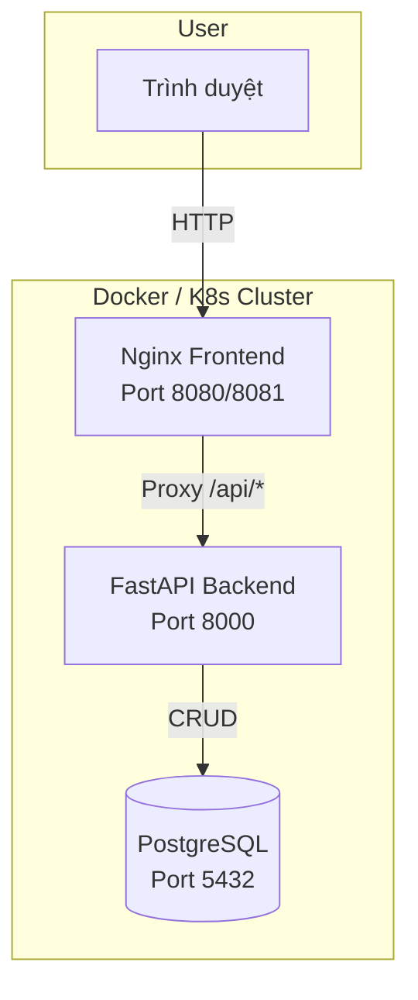
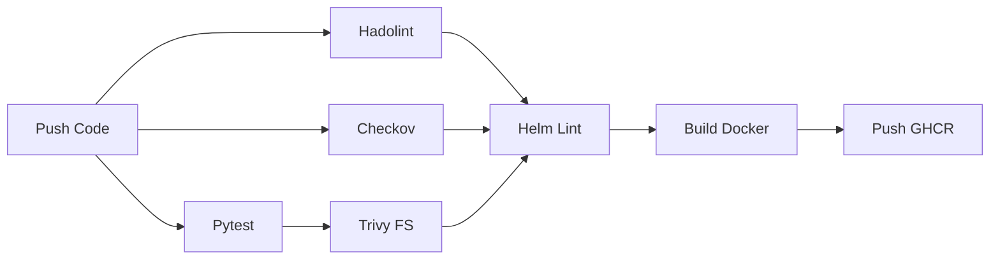
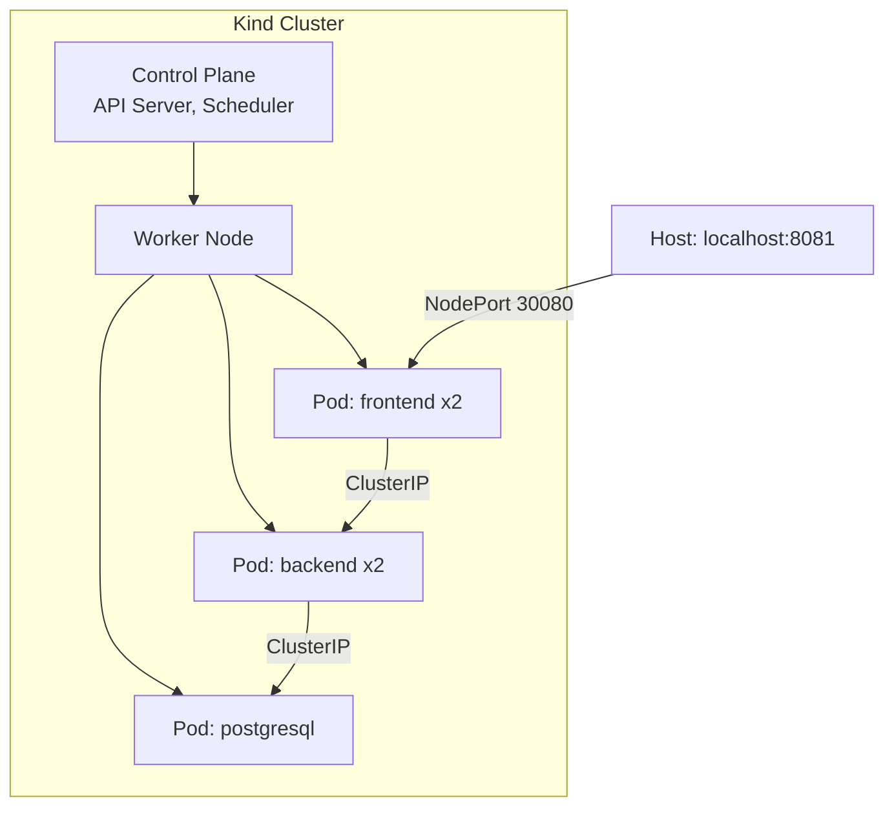
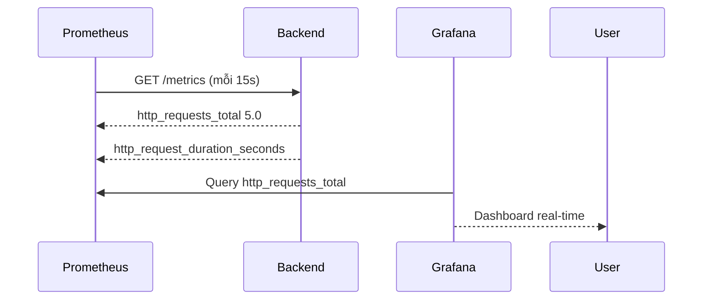
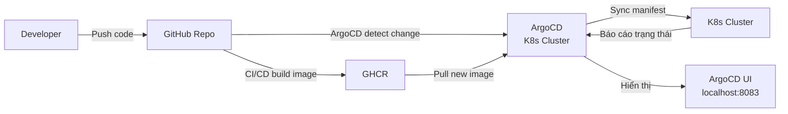

# Slide 1: Bìa - Giới Thiệu Đồ Án

**Xây Dựng Pipeline DevSecOps & GitOps Cho Ứng Dụng MiniBlog**

---

**Môn học:** SE359 - DevOps  
**Đề tài:** InkNotes - Ứng dụng MiniBlog (FastAPI + PostgreSQL + Nginx)  
**Nội dung:** CI/CD | Containerization | Kubernetes | Helm | Monitoring | GitOps  

**Công nghệ sử dụng:**
| Công nghệ | Mục đích |
|-----------|----------|
| Docker & Docker Compose | Container hóa ứng dụng |
| GitHub Actions | CI/CD tự động |
| Kubernetes (Kind) | Triển khai container |
| Helm | Quản lý package K8s |
| Prometheus + Grafana | Giám sát metrics |
| ArgoCD | GitOps tự động deploy |

---

# Slide 2: Kiến Trúc Hệ Thống

**3-Tier Architecture: Frontend → Backend → Database**



| Layer | Công nghệ | Nhiệm vụ |
|-------|-----------|----------|
| **Frontend** | Nginx + HTML/CSS/JS | Giao diện blog, reverse proxy /api/* |
| **Backend** | FastAPI + SQLAlchemy | REST API: CRUD bài viết, metrics /metrics |
| **Database** | PostgreSQL 16 | Lưu trữ bài viết |

**Luồng request:** Browser → `localhost:8080` → Nginx serve static → Nếu `/api/*` → proxy sang Backend `:8000` → Backend query DB `:5432` → Trả JSON về Browser.

---

# Slide 3: Containerization - Docker

**Dockerfile Best Practices đã áp dụng:**

| Dockerfile | Base Image | Dung tích | Đặc điểm |
|-----------|-----------|-----------|----------|
| `backend/Dockerfile` | `python:3.11-slim` | ~120MB | `--no-cache-dir`, WORKDIR, EXPOSE 8000 |
| `frontend/Dockerfile` | `nginx:alpine` | ~23MB | Static HTML, Nginx config |

**Docker Compose - 3 services:**

```yaml
services:
  db:       # postgres:16-alpine + healthcheck + volume
  backend:  # FastAPI + depends_on db (condition: healthy)
  frontend: # Nginx + depends_on backend
```

**Lệnh chạy:**
```bash
docker compose up --build -d
# Frontend: http://localhost:8080
# Backend:  http://localhost:8002/docs
```

---

# Slide 4: DevSecOps CI/CD - GitHub Actions

**Pipeline tự động hóa 7 bước:**



| Bước | Công cụ | Mục đích |
|:----:|---------|----------|
| 1 | **Pytest** | 8 unit test backend |
| 2 | **Hadolint** | Kiểm tra Dockerfile best practices |
| 3 | **Checkov** | Quét bảo mật K8s manifests |
| 4 | **Trivy** | Quét lỗ hổng filesystem + Docker image |
| 5 | **SonarCloud** | Phân tích chất lượng code |
| 6 | **Helm Lint** | Kiểm tra Helm chart syntax |
| 7 | **Docker Build & Push** | Push lên GHCR với tag `latest` + `commit-sha` |

---

# Slide 5: Kubernetes - Kiến Trúc Triển Khai

**Cluster Kind: 1 Control Plane + 1 Worker Node**



**Tài nguyên đã triển khai trên K8s:**
- **13 resources**: 3 Deployments, 3 Services, 1 Secret, 1 PVC, 1 ConfigMap, 4 NetworkPolicies
- **Security**: runAsNonRoot, readOnlyRootFilesystem, drop ALL capabilities
- **Probes**: readinessProbe + livenessProbe cho tất cả containers

---

# Slide 6: Helm - Package Manager Cho K8s

**So sánh: Không Helm vs Có Helm**

| Tiêu chí | Không Helm | Có Helm |
|----------|-----------|---------|
| Số file | 8 file YAML riêng lẻ | 1 Chart + 3 values files |
| Đổi môi trường | Sửa từng file | `-f values-dev.yaml` hoặc `-f values-prod.yaml` |
| Deploy | `kubectl apply -f file1.yaml -f file2.yaml ...` | `helm install miniblog ./helm/miniblog/` |

**Cấu trúc Helm Chart:**
```
helm/miniblog/
├── Chart.yaml          # Metadata
├── values.yaml         # Default (prod)
├── values-dev.yaml     # Override cho Kind
├── values-prod.yaml    # Override cho Production
└── templates/          # 11 file template Go
    ├── backend/deployment.yaml   # {{ .Values.backend.replicas }}
    ├── frontend/service.yaml     # type: {{ .Values.frontend.serviceType }}
    └── postgres/pvc.yaml         # conditional: persistence.enabled
```

---

# Slide 7: Monitoring - Prometheus + Grafana

**Luồng metrics:**



**Các metrics được theo dõi:**

| Metric | Loại | Ý nghĩa |
|--------|------|---------|
| `http_requests_total` | Counter | Tổng số request (tăng dần) |
| `http_request_duration_seconds` | Histogram | Thời gian xử lý request |
| `python_info` | Gauge | Thông tin Python runtime |

**Truy cập:**
- Prometheus: http://localhost:9090
- Grafana: http://localhost:3030 (admin/admin)

---

# Slide 8: GitOps - ArgoCD

**Nguyên lý GitOps: Git là single source of truth**



**Cấu hình Application:**
```yaml
source:
  repoURL: https://github.com/kelvin2250/SE359_DevOps
  path: blog-app/helm/miniblog
  helm:
    valueFiles: [values-prod.yaml]
syncPolicy:
  automated:
    prune: true      # Tự động xóa resource thừa
    selfHeal: true   # Tự phục hồi nếu có thay đổi
```

---


---

# Slide 10: Kết Luận & Bài Học Kinh Nghiệm

**✅ Những gì đã đạt được:**

| Hạng mục | Thành quả |
|----------|----------|
| **Docker** | 2 Dockerfiles tối ưu (slim/alpine), 3 services Docker Compose |
| **CI/CD** | Pipeline 7 bước: Test → Lint → Scan → Build → Push |
| **K8s** | Cluster Kind 2 nodes, 13 resources, security hardened |
| **Helm** | Chart hoàn chỉnh, 2 môi trường (dev/prod) |
| **Monitoring** | Prometheus scrape metrics, Grafana dashboard |
| **GitOps** | ArgoCD auto-sync từ GitHub → K8s |

**🔧 Bài học kinh nghiệm thực tế:**

| Vấn đề | Giải pháp |
|--------|-----------|
| Postgres không ghi được PVC trên Windows/Kind | Dùng container storage thay vì persistent volume cho dev |
| Nginx không bind được port 80 non-root | Chạy frontend với `runAsRoot: true` trên Kind |
| Checkov báo thiếu securityContext | Thêm `runAsNonRoot`, `readOnlyRootFilesystem`, drop capabilities |
| Port 3000 conflict với project cũ | Đổi Grafana từ 3000 → 3030 |

**🎯 GitOps flow hoàn chỉnh:**
```
Push code → CI build/test → Push image → ArgoCD detect → Sync K8s → Done!
```
